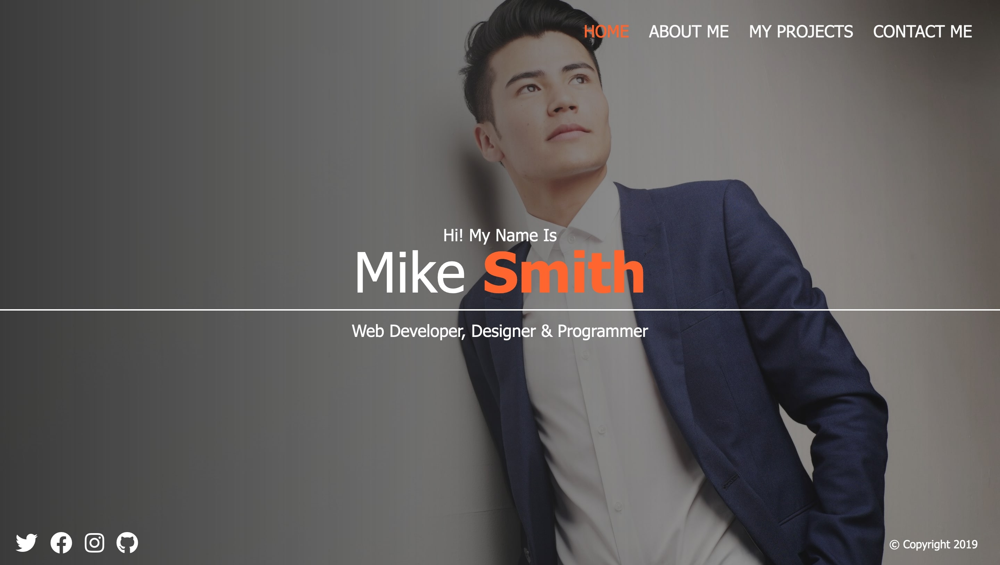

# Portfolio - SASS project

This is a project of the [Freecodecamp](https://www.youtube.com/watch?v=_a5j7KoflTs) tutorials on Youtube. The website was built from using Sass.

## About The Project

The project aims to create a portfolio website with a short bio, featured works and contact information.

Live site: https://alffonti.github.io/portfolio-sass/dist/index.html

## Built with

- [SASS](https://sass-lang.com/)
- [FontAwesome](https://fontawesome.com/)

## Acknowledgments

- [CodeSTACKR](https://www.codestackr.com/)
